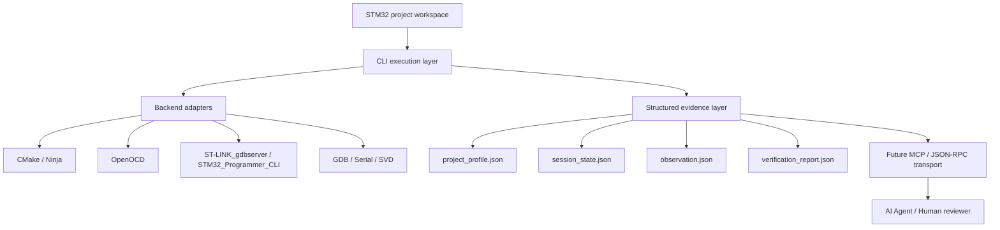

<div align="center">

[简体中文](README.md) | **English**


# embegent

Agent-ready execution layer for real STM32 debugging

Turn real-board build, flash, debug, and runtime observation into a reusable interface that can be exposed step by step through `CLI -> MCP -> Agent`.

`Python 3.11+` `STM32` `ST-LINK` `OpenOCD` `GDB` `CMake`

</div>

---

## Overview

`embegent` is not another IDE and it does not try to replace the existing embedded toolchain.

It focuses on one thing:

- Reuse existing STM32 projects, `CMakePresets.json`, `OpenOCD`, and `ST-LINK_gdbserver`
- Normalize `build -> flash -> debug -> monitor` into stable command surfaces
- Convert raw debug output into structured runtime context that an agent can consume
- Provide a trustworthy local execution layer for future `MCP tools` and `JSON-RPC`

In short, this project turns a human-driven IDE debugging flow into an auditable execution foundation for agents.

## Goal

In embedded AI-agent workflows, the main bottleneck is usually not code generation. It is this:

- the agent cannot observe the real board state
- the agent cannot access the debug session
- the prompt contains source code but no runtime evidence
- raw `GDB / OpenOCD / serial` output is too noisy and too expensive to ship as context

`embegent` is built to solve that:

> Give an agent enough real STM32 debug information to reason correctly, without wasting context budget.

The core idea is not "more commands". The core idea is to reshape the real-board debug chain into an execution architecture that fits agent collaboration.

## Current Status

The current stage is a real `CLI MVP`, not a dry skeleton.

The codebase has already completed the first restructuring round:

- `cli.py` handles command entry and orchestration
- `project.py` handles config, backend resolution, and process execution
- `state.py` remains a compatibility surface, while the implementation is now split into `state_paths.py / state_lock.py / state_runtime.py`
- `svd.py` handles SVD fetching and parsing
- `debug_support.py` handles GDB helpers and snapshot collection
- `tools/build.py` implements build execution
- `tools/flash.py` implements flash execution
- `tools/debug.py` remains a compatibility surface, while the implementation is now split into `debug_session.py / debug_actions.py / debug_snapshot.py`
- `tools/monitor.py` implements serial monitor execution
- `tools/svd.py` implements SVD fetch execution
- `tools/verify.py` provides shared verification-record helpers
- `app/context.py` assembles agent-facing structured context

Available commands:

- `doctor`
- `build`
- `flash`
- `monitor`
- `svd fetch`
- `debug start`
- `debug stop`
- `debug step`
- `debug continue`
- `debug registers`
- `debug backtrace`
- `debug snapshot`
- `debug peripheral-read`

Validated on a real project and a real board:

- `build`
- `flash --backend openocd`
- `flash --backend stlink`
- `debug start --backend openocd`
- `debug start --backend stlink`
- `debug registers`
- `debug step`
- `debug continue`
- `debug backtrace`
- `debug snapshot`
- `debug stop`
- `svd fetch --chip STM32H750VBT6`
- `debug peripheral-read --peripheral RCC --register CR`

The reference hardware workspace is included in this repository:

- `workspaces/stm32h750vbt6`

## Scope Boundary

### In Scope

- Local automation pipeline for STM32 projects
- Compatibility with existing `VS Code + CMake + OpenOCD + ST-LINK + GDB` workflows
- Single-board, single-active-session debugging
- Build, flash, start debug, step, continue, backtrace, register reads, serial monitor
- SVD download and semantic peripheral-register decoding
- Evidence persistence and structured summaries

### Not Promised Yet

- Replacing the graphical experience of `VS Code / CubeIDE`
- Multi-board concurrent debugging from day one
- First-release support for `J-Link`, `PyOCD`, or `Ozone`
- Full breakpoint management, expression evaluation, variable watch, or RTOS-aware debugging in the MVP
- Feeding raw `GDB / OpenOCD / serial` output directly into the agent context

### Non-Goals

- Building a general-purpose embedded IDE
- Unifying every probe and vendor tool in the first release
- Letting the model consume raw terminal noise directly

## Design Principles

- Reuse existing project configuration instead of rebuilding the toolchain
- Stabilize CLI first, expose MCP later
- Produce evidence first, add richer summaries second
- Prefer structured debug context over raw logs
- Human validation takes priority over model inference

## Architecture

The current system is best understood as four layers:



### 1. Workspace Layer

The project does not own your firmware logic. It reuses an existing STM32 firmware workspace.

### 2. CLI Execution Layer

This is the current MVP core. It is responsible for:

- reading configuration
- dispatching `build / flash / debug / monitor`
- managing background sessions
- persisting logs and state
- exposing stable command interfaces

In the ideal direction, this layer should remain thin. It should receive a request, collect the minimal context, call the right tool, and write the result back to the state layer.

### 3. Backend Adapter Layer

Current backend integrations:

- `CMake / presets`
- `OpenOCD`
- `ST-LINK_gdbserver`
- `STM32_Programmer_CLI`
- `arm-none-eabi-gdb`
- `pyserial`
- `CMSIS-SVD`

The responsibility of this layer is to integrate real tools, not to reinvent them.

The second restructuring round is now pushing execution logic into `src/stm32_agent/tools/`:

- `build`
- `flash`
- `debug`
- `monitor`
- `svd`
- `verify`

What already exists today:

- `tools/build.py`
- `tools/flash.py`
- `tools/debug.py`
- `tools/monitor.py`
- `tools/svd.py`
- `tools/verify.py`

Inside the debug area, `tools/debug.py` now only re-exports the public entry points. The actual responsibilities are separated into:

- `debug_session.py`
- `debug_actions.py`
- `debug_snapshot.py`

The debug layer now also includes session-level serialization:

- `debug start / stop / step / continue / registers / backtrace / snapshot / peripheral-read`
- these commands share the same session lock
- if an agent or client schedules them in parallel by mistake, they queue or fail with "session busy" instead of corrupting `session.json`
- `flash` also refuses to run when an active debug session exists, so flashing and live debugging do not contend for the same hardware resources

### 4. Structured Evidence Layer

This is what makes `embegent` different from a pile of shell scripts.

The runtime context is split into four files:

- `project_profile.json`
- `session_state.json`
- `observation.json`
- `verification_report.json`

The goal is to spend context where it matters:

- static background is recorded once
- session state stays compact
- dynamic observation keeps only the recent window
- every validation result is tied to evidence

The `session_state.json` payload is now also built through a single shared path, so lock updates and debug-state updates do not drift apart under concurrent command scheduling.

## Ideal Agent Architecture

If `embegent` grows into a real agent-ready system, these five rules matter the most:

### 1. The main agent should only orchestrate

The main agent should not directly carry every detail. It should:

- decide which debugging stage it is in
- choose the next tool to call
- decide which layer of context to read
- return the next action or conclusion

This avoids a single agent becoming executor, observer, summarizer, and explainer all at once.

### 2. Tools should own real execution

`build / flash / debug / monitor / svd / verify` should be standalone capabilities, not giant branches hard-coded in the main loop.

That makes the system:

- easier to test
- easier to swap backends
- easier to expose through MCP
- easier to attribute failures correctly

### 3. Context must be loaded on demand

The agent should not see everything by default. It should read summaries first and only expand when needed:

- start with `session_state.json`
- then inspect `observation.json`
- if needed, request `debug snapshot`
- only then fall back to raw logs or raw GDB output

That is how context gets used where it matters.

### 4. Slow work should move to background tasks

Long builds, long flashes, long monitors, and long observation windows should not block the whole interaction.

The intended direction is:

- background debug sub-tasks
- continuous monitor sampling
- build and validation results written back into state
- the main agent only reading compact summaries

### 5. Adapters must stay decoupled from core logic

CLI, MCP, JSON-RPC, and VS Code integration should not dictate the core design.

The right separation is:

- the core cares about execution and evidence
- adapters care about how those capabilities are exposed

That keeps the core reusable across different agent hosts.

## Agent Context Model

If the end goal is agent-driven closed-loop validation, this matters more than adding more commands.

### `project_profile.json`

Low-frequency static profile so background does not need to be repeated in every prompt.

Typical content:

- workspace path
- ELF path
- backend and probe
- presets
- serial settings
- SVD path
- chip metadata

### `session_state.json`

The minimum navigation state for the current session.

Typical content:

- session id
- halted / running / stopped
- current `PC / LR / SP`
- current source location
- latest command
- backend state
- current session-lock status, including `busy / idle`, owner action, and lock age

### `observation.json`

The main working context for the agent, intentionally windowed instead of full-history.

Typical content:

- latest register summary
- latest backtrace
- recent step delta
- recent peripheral decode
- recent serial monitor lines

### `verification_report.json`

Evidence-oriented output for both humans and agents.

Typical content:

- action
- summary
- `verification_status`
- evidence paths
- key state snapshot

The read order matters:

1. read `project_profile.json` for background
2. read `session_state.json` for navigation
3. read `observation.json` for reasoning
4. read `verification_report.json` for judgment

Only fall back to raw logs when these summaries are not enough.

## Verification Levels

To avoid false certainty, results should carry one of these labels:

- `unverified`
- `cli_verified`
- `hardware_verified`
- `human_verified`

The meaning is simple:

- a CLI success is not automatically a hardware truth
- only a real-board run can be marked `hardware_verified`
- only a human-confirmed result can be marked `human_verified`

## Command Surface

### CLI Commands

```bash
stm32-agent doctor
stm32-agent build
stm32-agent flash
stm32-agent monitor
stm32-agent svd fetch --chip STM32H750VBT6
stm32-agent debug start
stm32-agent debug step
stm32-agent debug continue
stm32-agent debug registers
stm32-agent debug backtrace
stm32-agent debug snapshot
stm32-agent debug peripheral-read --peripheral RCC --register CR
stm32-agent debug stop
```

### Intended Agent Tools

Action-oriented tools:

- `stm32_build`
- `stm32_flash`
- `stm32_debug_start`
- `stm32_debug_step`
- `stm32_debug_continue`
- `stm32_debug_stop`
- `stm32_monitor`
- `stm32_svd_fetch`

Semantic tools:

- `stm32_get_execution_snapshot`
- `stm32_get_runtime_summary`
- `stm32_verify_expectation`
- `stm32_collect_failure_bundle`

In practice, the recommended agent surface should stay coarse-grained:

- `stm32_build`
- `stm32_flash`
- `stm32_debug_start`
- `stm32_debug_snapshot`
- `stm32_debug_step`
- `stm32_debug_continue`
- `stm32_debug_stop`
- `stm32_verify_expectation`

Teach the agent to decide from summaries first, then drill down only when needed.

## Repository Layout

```text
embegent/
  configs/examples/          example configurations
  src/stm32_agent/           CLI, tool modules, and state model
  tests/                     minimal tests and fixtures
  workspaces/stm32h750vbt6/  real-board validation workspace
```

Current responsibilities:

- `src/stm32_agent/cli.py`
  thin command entry and orchestration
- `src/stm32_agent/project.py`
  config model, executable discovery, backend resolution, shared command execution
- `src/stm32_agent/state.py`
  structured state and evidence under `.stm32-agent/`
- `src/stm32_agent/svd.py`
  CMSIS-SVD fetching, parsing, and peripheral metadata handling
- `src/stm32_agent/debug_support.py`
  GDB batch helpers, session helpers, snapshot collection, register and backtrace extraction
- `src/stm32_agent/tools/build.py`
  build command implementation
- `src/stm32_agent/tools/flash.py`
  flash command implementation
- `src/stm32_agent/tools/debug.py`
  compatibility entry for debug capabilities, internally split into `debug_session / debug_actions / debug_snapshot`
- `src/stm32_agent/tools/monitor.py`
  monitor command implementation
- `src/stm32_agent/tools/svd.py`
  SVD fetch command implementation
- `src/stm32_agent/tools/verify.py`
  shared helper for structured verification recording
- `src/stm32_agent/app/context.py`
  agent-facing context aggregation entry for `project_profile / session_state / observation / verification`

This means the codebase has already moved through two restructuring steps:

- first: `cli.py -> project.py / state.py / svd.py / debug_support.py`
- second: `cli.py -> tools/build.py / tools/flash.py / tools/debug.py / tools/monitor.py / tools/svd.py`
- third: `app/context.py` starts to provide a stable agent-facing view over the state layer

The longer-term internal layout is expected to keep moving toward:

```text
src/stm32_agent/
  app/           orchestration, context building, sessions, background tasks
  tools/         build / flash / debug / monitor / svd / verify
  state/         project_profile / session_state / observation / verification
  adapters/      cli / mcp / jsonrpc / vscode
```

## Quick Start

### 1. Install

```bash
pip install -e .
```

### 2. Try the included workspace

```bash
stm32-agent build -c configs/examples/stm32h750vbt6.openocd.yaml
stm32-agent flash -c configs/examples/stm32h750vbt6.openocd.yaml
stm32-agent debug start -c configs/examples/stm32h750vbt6.openocd.yaml
stm32-agent debug snapshot -c configs/examples/stm32h750vbt6.openocd.yaml --watch RCC:CR
stm32-agent debug stop -c configs/examples/stm32h750vbt6.openocd.yaml
```

### 3. Fetch SVD and inspect a peripheral register

```bash
stm32-agent svd fetch --workspace workspaces/stm32h750vbt6 --chip STM32H750VBT6
stm32-agent debug peripheral-read -c configs/examples/stm32h750vbt6.openocd.yaml --peripheral RCC --register CR
```

## Human Validation

Before exposing results to an agent, keep a clear human verification path:

1. command-level check
   make sure `build / flash / debug start / snapshot / stop` all work
2. behavior-level check
   confirm LED, serial banner, GPIO state, task state, or other visible behavior
3. evidence-level check
   inspect `.stm32-agent/` session, logs, observations, and verification files

This keeps every "success" claim tied to a reviewable evidence chain.

## Known Gaps

- Intermittent `ST-LINK` verify mismatch is still under investigation
- The current MVP focuses on single-board, single-session operation
- Breakpoint management, variable inspection, and expression evaluation are not in place yet
- MCP exposure and JSON-RPC dual framing are not completed yet
- The context schema will keep tightening to reduce agent token cost

## Roadmap

### Phase 1. Stabilize CLI

- close the trust gap in `flash --backend stlink`
- keep expanding real-board regression checks
- standardize error codes, summaries, and log format

### Phase 2. Tighten context

- refine `project_profile / session_state / observation / verification_report`
- reduce unnecessary raw text
- increase the density of semantic snapshots
- make summary-first and evidence-on-demand the default read strategy

### Phase 3. Expose MCP

- map CLI commands into coarse-grained MCP tools
- prefer semantic outputs over raw byte streams
- let agents reason over snapshots and validation results, not over raw terminal text

### Phase 4. Add transport compatibility

- support dual JSON-RPC framing styles
- add isolated environment management
- improve cross-client compatibility and reproducibility

### Phase 5. Background debug sub-tasks

- move long builds, long monitor sessions, and long validation runs into background tasks
- keep the main agent focused on orchestration and decision making
