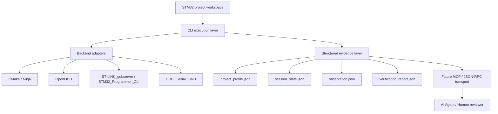

<div align="center">

[简体中文](README.md) | **English**

# embegent

CLI + MCP execution-layer prototype for STM32 hardware debugging

Turn real-board build, flash, debug, and runtime observation into an engineering interface that can be exposed step by step through `CLI -> MCP -> Agent`.

`Python 3.11+` `STM32` `ST-LINK` `OpenOCD` `GDB` `CMake`

</div>

---

## Overview

`embegent` is not another IDE, and it does not try to replace the existing embedded toolchain.

It focuses on one thing:

- Reuse existing STM32 projects, `CMakePresets.json`, `OpenOCD`, and `ST-LINK_gdbserver`
- Normalize `build -> flash -> debug -> monitor` into stable CLI commands
- Turn raw debug output into structured runtime context for agents
- Provide a trustworthy local execution layer for future `MCP tools` and `JSON-RPC` transport

In short, this project turns a human-driven IDE debugging flow into an auditable, scriptable execution foundation for agents.

## Goal

The main problem in embedded AI-agent workflows is usually not code generation. It is this:

- The agent cannot see the real hardware state
- It cannot access the debug session
- The context contains source code but no runtime evidence
- Once connected to `GDB / OpenOCD / serial`, the raw output becomes too noisy and too large

`embegent` is built to solve that:

> Give an agent enough real STM32 debug information to reason accurately, without wasting context budget.

## Current Status

The current stage is a real `CLI MVP`, not just a scaffold.

Available commands:

- `doctor`
- `build`
- `flash`
- `monitor`
- `svd fetch`
- `debug start`
- `debug stop`
- `debug step`
- `debug continue`
- `debug registers`
- `debug backtrace`
- `debug snapshot`
- `debug peripheral-read`

Validated on a real project and a real board:

- `build`
- `flash --backend openocd`
- `flash --backend stlink`
- `debug start --backend openocd`
- `debug start --backend stlink`
- `debug registers`
- `debug step`
- `debug continue`
- `debug backtrace`
- `debug snapshot`
- `debug stop`
- `svd fetch --chip STM32H750VBT6`
- `debug peripheral-read --peripheral RCC --register CR`

The reference hardware workspace is included in this repository:

- `workspaces/stm32h750vbt6`

## Scope Boundary

### In Scope

- Local automation pipeline for STM32 projects
- Compatibility with existing `VS Code + CMake + OpenOCD + ST-LINK + GDB` workflows
- Single-board, single-active-session debugging
- Build, flash, start debug, step, continue, backtrace, register reads, serial monitor
- SVD download and peripheral-register semantic decoding
- Evidence persistence and structured summaries

### Not Promised Yet

- Replacing the graphical experience of `VS Code / CubeIDE`
- Multi-board concurrent debugging from day one
- First-version support for `J-Link`, `PyOCD`, or `Ozone`
- Full breakpoint management, expression evaluation, variable watch, or RTOS-aware debugging in MVP
- Feeding raw `GDB / OpenOCD / serial` output directly into the agent context

### Non-Goals

- Building a general-purpose embedded IDE
- Unifying every probe and vendor tool in the first release
- Letting the model consume raw noisy terminal output directly

## Design Principles

- Reuse existing project configuration instead of rebuilding the toolchain
- Stabilize CLI first, expose MCP later
- Produce evidence first, add smarter summaries second
- Prefer structured debug context over raw logs
- Human validation has higher priority than model inference

## Architecture

The current architecture is better understood as four layers:



### 1. Workspace Layer

The project does not own your firmware logic. It reuses an existing STM32 firmware workspace.

### 2. CLI Execution Layer

This is the current MVP core.

It is responsible for:

- Reading configuration
- Running `build / flash / debug / monitor`
- Managing background sessions
- Persisting logs and state
- Exposing stable command interfaces

### 3. Backend Adapter Layer

Current backend integrations:

- `CMake / presets`
- `OpenOCD`
- `ST-LINK_gdbserver`
- `STM32_Programmer_CLI`
- `arm-none-eabi-gdb`
- `pyserial`
- `CMSIS-SVD`

### 4. Structured Evidence Layer

This is what makes `embegent` different from a pile of shell scripts.

The current runtime context is split into four files:

- `project_profile.json`
- `session_state.json`
- `observation.json`
- `verification_report.json`

The purpose is to spend context where it matters:

- Static background is recorded once
- Session state stays compact
- Dynamic observation keeps only the recent window
- Every verification result is tied to evidence

## Agent Context Model

If the end goal is agent-driven closed-loop validation, this layer matters more than adding more commands.

### `project_profile.json`

Low-frequency static profile, so background does not need to be repeated in every prompt.

### `session_state.json`

Compact navigation state for the current debug session.

### `observation.json`

The main working context for the agent, intentionally windowed instead of full-history.

### `verification_report.json`

Evidence-oriented output for both humans and agents to judge the result.

## Verification Levels

To avoid false certainty, results should carry a confidence label:

- `unverified`
- `cli_verified`
- `hardware_verified`
- `human_verified`

## Command Surface

### CLI Commands

```bash
stm32-agent doctor
stm32-agent build
stm32-agent flash
stm32-agent monitor
stm32-agent svd fetch --chip STM32H750VBT6
stm32-agent debug start
stm32-agent debug step
stm32-agent debug continue
stm32-agent debug registers
stm32-agent debug backtrace
stm32-agent debug snapshot
stm32-agent debug peripheral-read --peripheral RCC --register CR
stm32-agent debug stop
```

### Intended Agent Tools

Action-oriented tools:

- `stm32_build`
- `stm32_flash`
- `stm32_debug_start`
- `stm32_debug_step`
- `stm32_debug_continue`
- `stm32_debug_stop`
- `stm32_monitor`
- `stm32_svd_fetch`

Semantic tools:

- `stm32_get_execution_snapshot`
- `stm32_get_runtime_summary`
- `stm32_verify_expectation`
- `stm32_collect_failure_bundle`

## Repository Layout

```text
embegent/
  configs/examples/          example configurations
  src/stm32_agent/           CLI and debug pipeline implementation
  tests/                     minimal tests and fixtures
  workspaces/stm32h750vbt6/  real-board validation workspace
```

## Quick Start

### 1. Install

```bash
pip install -e .
```

### 2. Try the Included Workspace

```bash
stm32-agent build -c configs/examples/stm32h750vbt6.openocd.yaml
stm32-agent flash -c configs/examples/stm32h750vbt6.openocd.yaml
stm32-agent debug start -c configs/examples/stm32h750vbt6.openocd.yaml
stm32-agent debug snapshot -c configs/examples/stm32h750vbt6.openocd.yaml
stm32-agent debug stop -c configs/examples/stm32h750vbt6.openocd.yaml
```

### 3. Pull SVD and Read Peripheral Registers

```bash
stm32-agent svd fetch -c configs/examples/stm32h750vbt6.openocd.yaml --chip STM32H750VBT6
stm32-agent debug peripheral-read -c configs/examples/stm32h750vbt6.openocd.yaml --peripheral RCC --register CR
```

## Known Gaps

- Intermittent `ST-LINK` verify mismatch is still under investigation
- Current MVP focuses on single-board, single-session operation
- Breakpoint management, variable inspection, and expression evaluation are not in place yet
- MCP exposure and JSON-RPC dual-framing are not completed yet

## Roadmap

### Phase 1. Stabilize CLI

- Close the trust gap in `flash --backend stlink`
- Keep expanding real-board regression checks
- Standardize error codes, summaries, and log format

### Phase 2. Tighten Context

- Refine `project_profile / session_state / observation / verification_report`
- Reduce unnecessary raw text
- Increase information density in semantic snapshots

### Phase 3. Expose MCP

- Map CLI commands into coarse-grained MCP tools
- Prefer semantic tools over raw byte-level output

### Phase 4. Add Transport Compatibility

- Support dual JSON-RPC framing styles
- Add isolated environment management
- Improve cross-client compatibility and reproducibility
