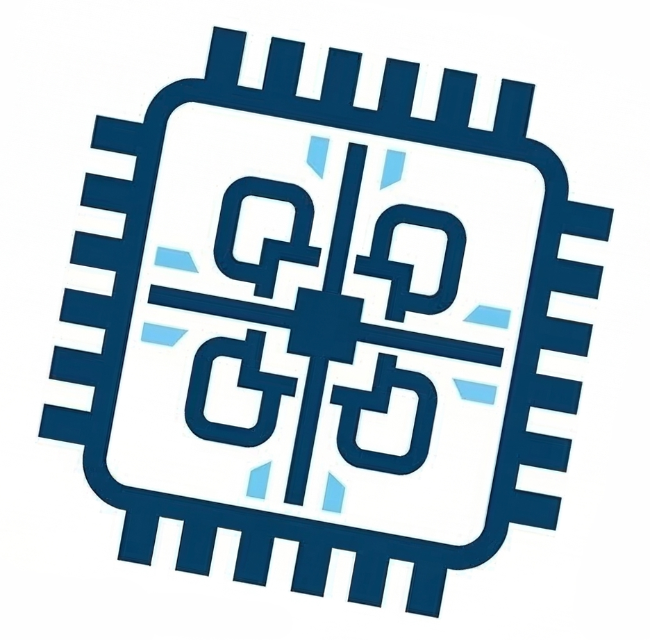
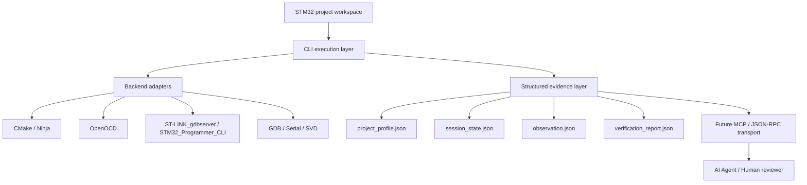

<div align="center">

**简体中文** | [English](README.en.md)



# embegent

面向 STM32 真机调试场景的 `CLI + MCP` 执行层原型

把真实板卡的构建、烧录、调试和运行态观测，整理成适合 `CLI -> MCP -> Agent` 逐层暴露的工程化接口。

`Python 3.11+` `STM32` `ST-LINK` `OpenOCD` `GDB` `CMake`

</div>

---

## 项目简介

`embegent` 不是一个新的图形集成开发环境，也不是要重做一整套嵌入式工具链。

它更聚焦于一件事：

- 复用现有 STM32 工程、`CMakePresets.json`、`OpenOCD`、`ST-LINK_gdbserver`
- 把 `build -> flash -> debug -> monitor` 收敛成稳定的命令行接口
- 把原始调试结果沉淀成适合 Agent 消费的结构化调试上下文
- 为后续 `MCP tools` 和 `JSON-RPC` 适配提供可信的本地执行层

也就是说这个项目要把人手点 IDE 的真机调试链路变成可脚本化、可被 Agent 调用的基础设施。

## 项目目标

当前 AI Agent 在嵌入式场景里最常见的问题不是不会写代码，而是：

- 拿不到真实板卡状态
- 看不到调试现场
- 上下文里只有源码，没有运行时证据
- 一旦接入 `GDB / OpenOCD / 串口`，原始输出又太大、太乱、太不适合模型消费

`embegent` 要解决的就是这件事：

> 让 Agent 可以在真实 STM32 工程上获得足够多、足够准、但不过载的调试信息。

这个项目的核心思想不是把更多调试命令塞给 Agent，而是把真机调试链路重构成一套更适合 Agent 协作的执行架构。


## 当前状态

当前阶段是 `CLI MVP`，已经不是空壳。

已具备的命令：

| 环境检查 | 构建 | 烧录 | 监视 | 获取 SVD | 启动调试 | 停止调试 | 单步执行 | 继续执行 | 读取寄存器 | 查看回溯 | 生成快照 | 读取外设寄存器 |
| --- | --- | --- | --- | --- | --- | --- | --- | --- | --- | --- | --- | --- |
| `doctor` | `build` | `flash` | `monitor` | `svd fetch` | `debug start` | `debug stop` | `debug step` | `debug continue` | `debug registers` | `debug backtrace` | `debug snapshot` | `debug peripheral-read` |

已在真实工程和真实板卡上跑通过的链路：

| 构建 | OpenOCD 烧录 | ST-LINK 烧录 | OpenOCD 启动调试 | ST-LINK 启动调试 | 读取寄存器 | 单步执行 | 继续执行 | 查看回溯 | 生成快照 | 停止调试 | 获取 STM32H750VBT6 的 SVD | 读取 RCC.CR 寄存器 |
| --- | --- | --- | --- | --- | --- | --- | --- | --- | --- | --- | --- | --- |
| `build` | `flash --backend openocd` | `flash --backend stlink` | `debug start --backend openocd` | `debug start --backend stlink` | `debug registers` | `debug step` | `debug continue` | `debug backtrace` | `debug snapshot` | `debug stop` | `svd fetch --chip STM32H750VBT6` | `debug peripheral-read --peripheral RCC --register CR` |

真实验证基于的工程样例已纳入仓库：

- [`workspaces/stm32h750vbt6`](workspaces/stm32h750vbt6)


## 实际架构

当前功能范围内实现了
- 面向 STM32 工程的本地自动化链路
- 兼容已有 `VS Code + CMake + OpenOCD + ST-LINK + GDB` 工作流
- 单板、单活动调试会话管理
- 构建、烧录、启动调试、单步、继续、回溯、寄存器读取、串口监视
- SVD 下载与外设寄存器字段语义化读取
- 调试证据落盘和结构化摘要

当前未实现
-  `VS Code / CubeIDE` 的图形调试体验
- 多板并发调试
- 支持 `J-Link`、`PyOCD`、`Ozone`
- 有完整断点管理、表达式求值、变量观察、RTOS 感知调试


`embegent` 当前的实际组织不是“一个命令包”，而是 4 层结构：



再往实现职责上看，更适合把它理解成下面这条链：

```text
用户 / Agent 请求
  -> 主编排循环
  -> 调试工具执行层
  -> 结构化状态与证据层
  -> CLI / MCP / JSON-RPC 适配层
  -> 人类验收或 Agent 下一轮决策
```

### 1. 工程工作区层

项目本身不拥有你的固件逻辑，它复用现有 STM32 工程作为工作空间。

当前仓内示例：

- `workspaces/stm32h750vbt6`

### 2. 命令行执行层

这是当前已经成立的 MVP 核心。

它负责：

- 读配置
- 发起 `build / flash / debug / monitor`
- 管理后台 session
- 落盘日志与状态
- 对外输出稳定命令接口

它不应该负责的事情是：

- 承载复杂业务判断
- 自己解释所有调试现象
- 直接把原始噪声输出喂给模型

理想状态下，这一层对应一个很薄的主编排循环，只负责：

- 接收请求
- 读取当前工作区和会话状态
- 组装最小上下文
- 调用合适工具
- 把结果写回状态层

### 3. 后端适配层

当前已接入的后端能力：

- `CMake / presets`
- `OpenOCD`
- `ST-LINK_gdbserver`
- `STM32_Programmer_CLI`
- `arm-none-eabi-gdb`
- `pyserial`
- `CMSIS-SVD`

这层的职责是和真实工具对接，而不是把工具能力重新发明一遍。

从长期演进看，这一层更适合继续拆成独立工具模块：

- `build`
- `flash`
- `debug`
- `monitor`
- `svd`
- `verify`

这样主循环只负责调度，具体执行和异常处理都留在工具层。

### 4. 结构化证据层

这是项目和普通脚本堆砌方案最大的不同点。

当前已经开始把调试上下文按用途拆成四类文件：

- `project_profile.json`
- `session_state.json`
- `observation.json`
- `verification_report.json`

它们的目的不是“多写几个 JSON”，而是把 context 用在刀刃上：

- 静态背景只记录一次
- 会话状态保持最小
- 动态观测只保留最近窗口
- 验证结论必须附带证据

这一层的意义，是把“调试信息”变成“Agent 可消费、也能被人类复核”的调试上下文，而不是单纯写几份 JSON。

## 理想的 Agent 架构

如果把这个项目真正做成 Agent-ready 体系，最值得坚持的是下面 5 条：

### 1. 主代理只做编排

主代理不直接承担所有细节逻辑，它只做：

- 判断当前处于什么调试阶段
- 决定下一步调用哪个工具
- 选择需要读取哪一层上下文
- 输出下一步行动或结论

这能避免“一个 Agent 同时负责执行、观察、总结、解释”带来的复杂度失控。

### 2. 工具层负责真实执行

`build / flash / debug / monitor / svd / verify` 应该是独立能力，而不是写死在主循环里的分支。

这样做的好处是：

- 更容易测试
- 更容易替换 backend
- 更容易把 CLI 暴露成 MCP tools
- 更容易对失败做精确归因

### 3. 上下文必须按需加载

这点非常关键。

Agent 不应该默认看到所有原始输出，而应该先看到摘要，再按需展开：

- 先看 `session_state.json`
- 再看 `observation.json`
- 还不够再取 `debug snapshot`
- 最后必要时才看原始日志或原始 GDB 文本

这就是“把 context 用在刀刃上”。

### 4. 慢任务应该后台化

长构建、长烧录、长监视、长时间观测，不应该阻塞整个交互。

后续理想形态里，`embegent` 应该支持：

- 调试子任务后台执行
- 长时间 monitor 持续采样
- 构建或验证结束后把结果写回事件或状态层
- 主代理只读取结果摘要并继续决策

### 5. 适配层必须和核心逻辑解耦

CLI、MCP、JSON-RPC、VS Code 集成都不应该反过来塑造核心业务结构。

更合理的关系是：

- 核心层只关心执行和证据
- 适配层只关心怎么把核心能力暴露出去

这样后面不管你接 `MCP`、接 VS Code、还是接别的 Agent Host，都不用重写核心逻辑。

## 面向 Agent 的调试上下文组织

如果最终目标是让 Agent 闭环测试，这一层比命令数量更重要。

### `project_profile.json`

低频静态画像，避免每轮提示词重复塞背景信息。

典型内容：

- 工程路径
- ELF 路径
- 调试后端 / 探针
- 预设配置
- 串口配置
- SVD 路径
- 芯片画像补充信息

### `session_state.json`

当前调试会话的最小导航信息。

典型内容：

- session id
- halted / running / stopped
- 当前 PC / LR / SP
- 当前源码位置
- 最近一次命令
- 调试后端状态

### `observation.json`

给 Agent 的主工作上下文，默认保留最近窗口而不是全量历史。

典型内容：

- 最近一次 `registers` 摘要
- 最近一次 `backtrace`
- 最近一次 `step` 前后 PC 变化
- 最近一次 `peripheral-read` 字段解析
- 最近若干条 `monitor` 输出

### `verification_report.json`

给人和 Agent 做判断的证据层。

典型内容：

- 执行动作
- 判定摘要
- `verification_status`
- 证据路径
- 关键状态快照

这四层并不是平铺文件，而是一套有顺序的读取策略：

1. 先读取 `project_profile.json` 了解工程背景
2. 再读取 `session_state.json` 确认当前调试位置
3. 如需推理，读取 `observation.json`
4. 如需判断成功与否，读取 `verification_report.json`

只有在这些摘要还不够的时候，才应该回退到原始日志、原始串口输出和原始 GDB 文本。

## 信息可信度分级

为避免给 Agent 错误确定性，结果需要带可信度分级：

- `unverified`
- `cli_verified`
- `hardware_verified`
- `human_verified`

含义很直接：

- CLI 自己判断成功，不等于硬件真的正确
- 真机跑过才算 `hardware_verified`
- 人类看过现象并确认，才算 `human_verified`

## 功能接口

### 命令行接口

```bash
stm32-agent doctor
stm32-agent build
stm32-agent flash
stm32-agent monitor
stm32-agent svd fetch --chip STM32H750VBT6
stm32-agent debug start
stm32-agent debug step
stm32-agent debug continue
stm32-agent debug registers
stm32-agent debug backtrace
stm32-agent debug snapshot
stm32-agent debug peripheral-read --peripheral RCC --register CR
stm32-agent debug stop
```

### 面向 Agent 的预期工具

更适合 Agent 暴露的接口会分两类：

动作类：

- `stm32_build`
- `stm32_flash`
- `stm32_debug_start`
- `stm32_debug_step`
- `stm32_debug_continue`
- `stm32_debug_stop`
- `stm32_monitor`
- `stm32_svd_fetch`

语义类：

- `stm32_get_execution_snapshot`
- `stm32_get_runtime_summary`
- `stm32_verify_expectation`
- `stm32_collect_failure_bundle`

原因是 Agent 真正需要的不是更多命令，而是更少噪声、更高密度的调试信息。

更进一步说，未来真正推荐暴露给 Agent 的，不是整套细粒度命令，而是少量粗粒度能力：

- `stm32_build`
- `stm32_flash`
- `stm32_debug_start`
- `stm32_debug_snapshot`
- `stm32_debug_step`
- `stm32_debug_continue`
- `stm32_debug_stop`
- `stm32_verify_expectation`

先让 Agent 学会基于摘要做决策，再按需下钻，是比“默认暴露所有内部细节”更稳的路线。

## 项目结构

当前仓库组织建议按下面理解：

```text
embegent/
  configs/examples/          示例配置
  src/stm32_agent/           CLI 与调试链路实现
  tests/                     最小测试与夹具
  workspaces/stm32h750vbt6/  真机验证样例工程
```

职责边界如下：

- `src/stm32_agent/cli.py`
  当前 MVP 主入口，承担命令编排、后端调用、上下文落盘
- `configs/examples/`
  让外部用户快速复用工程配置，而不是硬编码路径
- `workspaces/`
  放公开可参考的真实样例工程，用于验证链路而不是承载产品逻辑
- `.stm32-agent/`
  运行时状态目录，默认不入库

如果后续继续往理想架构演进，更推荐的内部组织会接近这样：

```text
src/stm32_agent/
  app/           主编排循环、上下文构建、会话与后台任务
  tools/         build / flash / debug / monitor / svd / verify
  state/         project_profile / session_state / observation / verification
  adapters/      cli / mcp / jsonrpc / vscode
```

当前还没有完全拆到这个粒度，但这是后续整理代码结构时更值得靠近的方向。

## 人工验收建议

准备公开后，推荐保留一条清晰的人类验收路径：

1. 命令层确认
   先确认 `build / flash / debug start / snapshot / stop` 都能执行。
2. 行为层确认
   再确认 LED、串口 banner、GPIO、任务状态等肉眼可判现象。
3. 证据层确认
   最后核对 `.stm32-agent/` 中的 session、log、observation、verification 文件。

这样以后 Agent 输出“成功”时，永远有一条人类可复核的证据链。

## 当前已知缺口

当前已经明确暴露出来、且公开时应该诚实写出的点：

- `ST-LINK` 烧录存在间歇性 verify mismatch，仍在定位
- 当前主要面向单板、单 session
- 断点管理、变量观察、表达式求值还未进入 MVP
- MCP 暴露层和 JSON-RPC 双帧适配还未完成
- context schema 还会继续收紧，目标是进一步降低 Agent token 开销

## 后续路线图

### 第一阶段：稳定 CLI

- 收口 `flash --backend stlink` 的可信度问题
- 继续补齐真实板卡回归
- 明确错误码、摘要和日志格式

### 第二阶段：收紧上下文模型

- 收紧 `project_profile / session_state / observation / verification_report`
- 减少无效 raw text
- 提高语义化快照密度
- 明确摘要优先、原始证据按需回退的读取策略

### 第三阶段：暴露 MCP

- 把 CLI 命令映射成粗粒度 MCP tools
- 优先暴露语义型接口，而不是逐字节原始输出
- 让 Agent 面向“调试快照和验证结果”决策，而不是面向原始终端文本决策

### 第四阶段：补齐传输兼容性

- 适配 JSON-RPC 双帧格式
- 增加隔离环境管理
- 提升跨客户端兼容性和复现效率

### 第五阶段：后台调试子任务

- 让长构建、长监视、长验证进入后台执行
- 用事件或状态更新把结果回送给主代理
- 保持交互链路持续可响应


## 许可证

暂未单独声明。准备公开前，建议补齐仓库许可证、贡献说明和最小 issue 模板。
